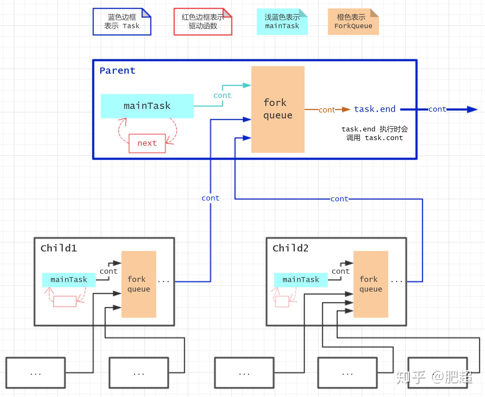
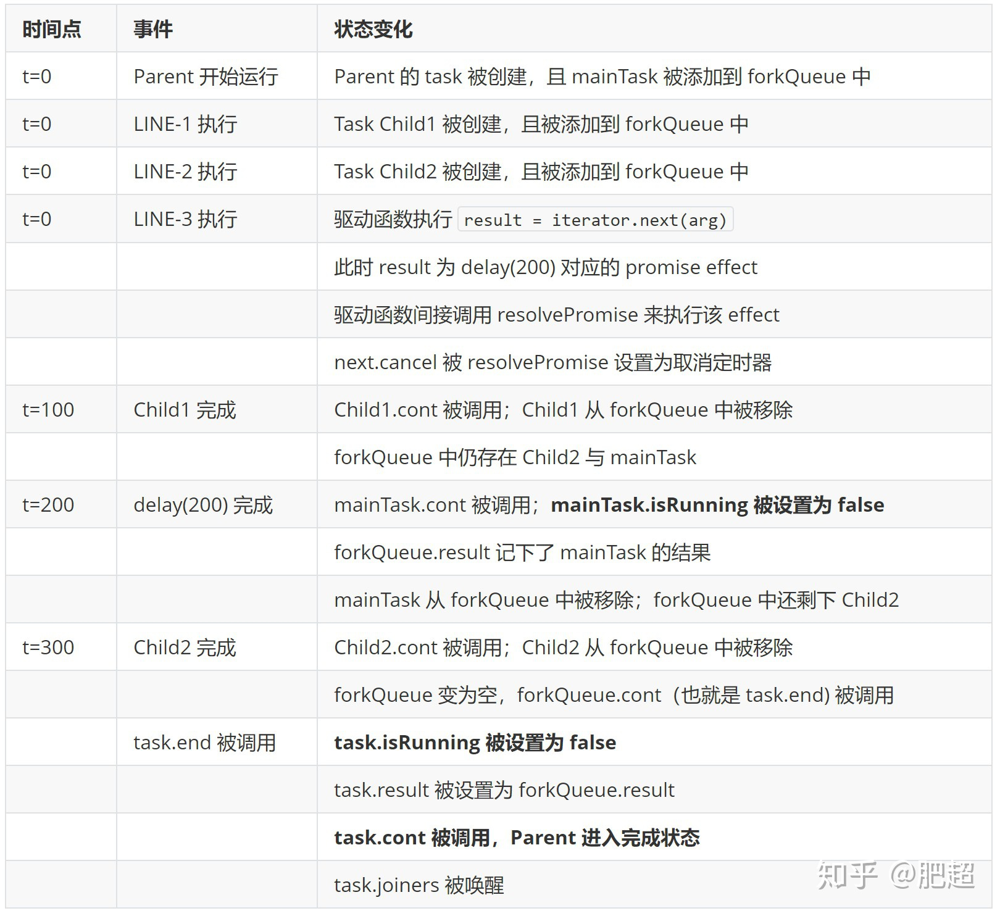

# Redux-saga 原理

## 前置知识

redux-saga本质就是一个generator函数，我们先简单回顾以下generator函数

### generator基本语法

```javascript
function* simpleGenerator() {
  const value1 = yield 1;
  const value2 = yield 'zy.zhang';
  const value3 = yield 2;
}
const iterator = simpleGenerator();
console.log(iterator.next()); //{ value: 1, done: false }
console.log(iterator.next()); //{ value: 'zy.zhang', done: false }
console.log(iterator.next()); //{ value: 2, done: false }
console.log(iterator.next()); //{ value: undefined, done: true }
```

[演示demo-generator.js]()

### generator函数自动执行

自动执行generator，通过递归next实现

```javascript
function autoRun(generator) {
  const it = generator();
  let result;
  function next(arg) {
    result = it.next(arg);
    if(!result.done) {
      next(result.value);
    }
  }
  next();
}
```

[演示demo-simple-co.js]()

### 能处理promise的co函数

```javascript
function co(gen) {
  var ctx = this;
  return new Promise(function(resolve, reject) {
    if (typeof gen === 'function') gen = gen.call(ctx);
    if (!gen || typeof gen.next !== 'function') return resolve(gen);

    onFulfilled();
    function next(ret) {
      if (ret.done) return resolve(ret.value);
      const { value } = ret;
      if (value && isPromise(value)) return value.then(onFulfilled);
    }
    function onFulfilled(res) {
      var ret;
      try {
        ret = gen.next(res);
      } catch (e) {
        return reject(e);
      }
      next(ret);
    }
  });
}
```

[演示demo-co.js]()

## redux-saga effects

```javascript
call(fetchUserApi)
// {type: 'CALL', payload: {fn: fetchUserApi}}

put({type: "USER_FETCH_SUCCEEDED", user: 'zzy'})
// {type: 'PUT', payload: {action: {type: "USER_FETCH_SUCCEEDED", user: "zzy"}}}

takeEvery("FETCH_USER", fetchUser);
// {type: 'FORK', payload: {args: ["FETCH_USER, f* fetchUser"]}}

```

effects是一个纯对象，{type, payload}表示saga里的各种指令，可以理解为针对当前类型(type)的指令我要处理哪些数据(payload)

## 核心流程

上面的generaor函数定义了各种指令，有的是发出有的是接受。定义好saga后就交给sagaMiddle来run

### 1. 创建middleware

```javascript
function sagaMiddleware({ getState, dispatch }) {
    boundRunSaga = runSaga.bind(null, {
      ...options,
      context,
      channel,
      dispatch,
      getState,
      sagaMonitor,
    })

    return next => action => {
      const result = next(action) // hit reducers
      channel.put(action)
      return result
    }
}

  sagaMiddleware.run = (...args) => {
    if (process.env.NODE_ENV !== 'production' && !boundRunSaga) {
      throw new Error('Before running a Saga, you must mount the Saga middleware on the Store using applyMiddleware')
    }
    return boundRunSaga(...args)
  }
```

redux中间件写法参考[Redux实现原理](http://git.dev.sh.ctripcorp.com/ibu-framework/ibu-tech-talk/tree/master/article/2020-10-27_Redux%E5%AE%9E%E7%8E%B0%E5%8E%9F%E7%90%86)

```javascript
boundRunSaga = runSaga.bind(null, {
  ...options,
  context,
  channel,
  dispatch,
  getState,
  sagaMonitor,
})
```

 预设了一些参数，dispatch, getState就是redux store原封不动提供的函数, channel函数稍后讲解,其他参数默认为空,在createSagaMiddle中传入。

### 2. runSaga

首先调用const iterator = saga(...args)

这里的saga就是我们传入的rootSaga，执行rootSaga返回迭代器iterator

接下来runSaga对入参做了包装

```javascript
  const env = {
    channel,
    dispatch: wrapSagaDispatch(dispatch),
    getState,
    sagaMonitor,
    onError,
    finalizeRunEffect,
  }
```

```javascript
  const iterator = saga(...args);
  if (effectMiddlewares) {
    const middleware = compose(...effectMiddlewares)
    finalizeRunEffect = runEffect => {
      return (effect, effectId, currCb) => {
        const plainRunEffect = eff => runEffect(eff, effectId, currCb)
        return middleware(plainRunEffect)(effect)
      }
    }
  } else {
    finalizeRunEffect = runEffect => runEffect
  }
```

  finalizeRunEffect是对runEffect的包装，如果createMiddleware时传入了effectMiddlewares参数，这个参数就是普通的redux中间件，如果你想某些中间件只增强saga不对普通的reducer做增强，可以用这个参数。如果不传入该参数，就原封不动的返回runEffect。
  前面都是预设包装变量，接下来调用proc(env, iterator, context, effectId, getMetaInfo(saga), /*isRoot*/ true, undefined)

### 3. proc

proc.js是saga运行的核心流程

看下面一段代码

```javascript
function* mySaga() {
  yield take('MY_TAKE1');
  // some code
  yield take('MY_TAKE2');
  // some code
}
```

```javascript
dispatch({
  type: 'MY_TAKE1'
});
// ...
dispatch({
  type: 'MY_TAKE2'
});
```

我们希望这段代码的作用是：当遇见第一个yield时，程序停住，并等待一个type:MY_TAKE1的action发出，接收到这个action之后程序恢复运行，知道遇到下一个yield并等待MY_TAKE2的action发出以便程序继续运行。我们来看下这个过程的实现

忽略掉task相关的东西，我们发现这里的实现方式和co函数很像。
定一个next，执行迭代器的next方法，判断迭代器是否实行完成，如果没有完成就调用runEffect，并把next自身作为参数传入runEffect

```javascript
export default function proc(env, iterator, parentContext, cont) {
  const mainTask = {
    // cont: **will be set when passed to ForkQueue**
    isRunning: true,
    isCancelled: false,
    cancel() {
      if (mainTask.isRunning && !mainTask.isCancelled) {
        mainTask.isCancelled = true
        next(TASK_CANCEL)
      }
    },
  }
  const task = new Task(mainTask, Object.create(parentContext))
  task.cont = cont
  cont.cancel = task.cancel
  next()

  return task

  // region function-definitions
  function next(arg, isErr) {
    console.assert(mainTask.isRunning, 'Trying to resume an already finished generator')

    try {
      let result
      if (isErr) {
        result = iterator.throw(arg)
      } else if (arg === TASK_CANCEL) {
        mainTask.isCancelled = true
        next.cancel()
        result = is.func(iterator.return)
          ? iterator.return(TASK_CANCEL)
          : { done: true, value: TASK_CANCEL }
      } else {
        result = iterator.next(arg)
      }

      if (!result.done) {
        runEffect(result.value, next)
      } else {
        mainTask.isRunning = false
        mainTask.cont(result.value)
      }
    } catch (error) {
      if (mainTask.isCancelled) {
        console.error(EXCEPTION_DURING_CANCELLATION, error)
      }
      mainTask.isRunning = false
      mainTask.cont(error, true)
    }
  }

  function runEffect(effect, cb) {
    if (is.promise(effect)) {
      resolvePromise(effect, cb)
    } else if (is.iterator(effect)) {
      resolveIterator(effect, cb)
    } else if (is.effect(effect)) {
      const runner = effectRunnerMap[effect.type]
      runner(env, task, effect.payload, cb, { runEffect })
    } else {
      cb(effect)
    }
  }

  function resolvePromise(promise, cb) {
    const cancelPromise = promise[CANCEL]
    if (is.func(cancelPromise)) {
      cb.cancel = cancelPromise
    }
    promise.then(cb, error => cb(error, true))
  }

  function resolveIterator(iterator, cb) {
    proc(env, iterator, task.taskContext, cb)
  }
  // endregion
}
```

我们来看下runEffect函数

```javascript
function runEffect(effect, cb) {
    if (is.promise(effect)) {
      resolvePromise(effect, cb)
    } else if (is.iterator(effect)) {
      resolveIterator(effect, cb)
    } else if (is.effect(effect)) {
      const runner = effectRunnerMap[effect.type]
      runner(env, task, effect.payload, cb, { runEffect })
    } else {
      cb(effect)
    }
}
```

如果传入的类型是promise,即yield一个promise

```javascript
yield PromiseInstance
```

会按照处理promise的方式处理effect，这里可以参考上面的 能处理promise的co函数。
如果传入另外一个generator，会递归的执行proc

我们这里先只考虑通过take函数生成的effect
effectRunnerMap[effect.type]会根据effect type来执行不同的effectRunner

```javascript
const effectRunnerMap = {
  [effectTypes.TAKE]: runTakeEffect,
  [effectTypes.PUT]: runPutEffect,
  [effectTypes.ALL]: runAllEffect,
  [effectTypes.RACE]: runRaceEffect,
  [effectTypes.CALL]: runCallEffect,
  [effectTypes.CPS]: runCPSEffect,
  [effectTypes.FORK]: runForkEffect,
  [effectTypes.JOIN]: runJoinEffect,
  [effectTypes.CANCEL]: runCancelEffect,
  [effectTypes.SELECT]: runSelectEffect,
  [effectTypes.ACTION_CHANNEL]: runChannelEffect,
  [effectTypes.CANCELLED]: runCancelledEffect,
  [effectTypes.FLUSH]: runFlushEffect,
  [effectTypes.GET_CONTEXT]: runGetContextEffect,
  [effectTypes.SET_CONTEXT]: runSetContextEffect,
}
```

我们先看一下最常用的take, put, call

#### call

假设有这么一段函数

```javascript
yield call(fetchUser, userId)
```

进入到runCallEffect里面,这里的fn和args就是fetchUser和userId
这里的处理方式和runEffect里差不多，如果是promise也调用了resolvePromise
强调一下 这里的cb是自己定义的next

```javascript
function runCallEffect(env, { context, fn, args }, cb, { task }) {
  // catch synchronous failures; see #152
  try {
    const result = fn.apply(context, args)

    if (is.promise(result)) {
      resolvePromise(result, cb)
      return
    }

    if (is.iterator(result)) {
      // resolve iterator
      proc(env, result, task.context, currentEffectId, getMetaInfo(fn), /* isRoot */ false, cb)
      return
    }

    cb(result)
  } catch (error) {
    cb(error, true)
  }
}
```

resolvePromise里按正常处理promie的方法，递归的调用了next()

```javascript
function resolvePromise(promise, cb) {
  const cancelPromise = promise[CANCEL]

  if (is.func(cancelPromise)) {
    cb.cancel = cancelPromise
  }

  promise.then(cb, error => {
    cb(error, true)
  })
}
```

```javascript
const res1 = yield call(xxx);
const res2 = yield call(xxx);
const res3 = yield call(xxx);
```

这样上面的这段代码就实现了自动执行

#### take

而take指令不会自动往下执行，而是等待一个action，显然是在两次递归中间加了一些东西

```javascript
function runTakeEffect(env, { channel = env.channel, pattern, maybe }, cb) {
  const takeCb = input => {
    if (input instanceof Error) {
      cb(input, true)
      return
    }
    if (isEnd(input) && !maybe) {
      cb(TERMINATE)
      return
    }
    cb(input)
  }
  try {
    channel.take(takeCb, is.notUndef(pattern) ? matcher(pattern) : null)
  } catch (err) {
    cb(err, true)
    return
  }
  cb.cancel = takeCb.cancel
}
```

take里面调用了channel.take(takeCb≈next)
先不管，再看一下put指令

#### put

```javascript
function runPutEffect(env, { channel, action, resolve }, cb) {
  /**
   Schedule the put in case another saga is holding a lock.
   The put will be executed atomically. ie nested puts will execute after
   this put has terminated.
   **/
  asap(() => {
    let result
    try {
      result = (channel ? channel.put : env.dispatch)(action)
    } catch (error) {
      cb(error, true)
      return
    }

    if (resolve && is.promise(result)) {
      resolvePromise(result, cb)
    } else {
      cb(result)
    }
  })
  // Put effects are non cancellables
}
```

put里调用了(channel.put || dispatch)(action)

两个effect都用到了channel，我们看看channel是啥

### 4. 监听和派发-通道(Channel)

我们回到middleware的代码中

```javascript
return next => action => {
  if (sagaMonitor && sagaMonitor.actionDispatched) {
    sagaMonitor.actionDispatched(action)
  }
  const result = next(action) // hit reducers
  channel.put(action)
  return result
}
```

发现每次dispatch都是调用到chaneel.put

两边分别调用了channel.take()和channel.put()。这里利用管道实现了发布订阅，每订阅一个事件就放入管道中，如果监听到了发布的事件就从管道中移除。
channel.js 提供了三种不同的channel,saga默认使用stdChannel,即标准管道

```javascript
// stdChannel
const stdChannel = () => {
  let currentTakers = [];
  function take(taker, matcher){
    taker['MATCH'] = matcher;
    taker.cancel = () => {
      currentTakers = currentTakers.filter(item => item !== taker);
    }
    currentTakers.push(taker);
  }
  function put(input) {
    currentTakers.forEach(taker => {
      if(taker['MATCH'](input)) {
        taker.cancel();
        taker(input);
      }
    });
  }
  return { take, put }
}
```

[演示channelDemo.js]()

take的时候往takers里push taker，taker是一个你想监听到订阅后执行的回调函数，并在taker上挂载cancel方法和MATCHER属性，cancel的作用是把当前taker从takers里移除，MATCHER属性是一个自定义的方法，用来匹配pattern
put的时候，接收你要监听的时间，遍历takers，通过taker上的MATCH判断是否匹配，如果是执行taker

### 非阻塞执行-fork

上面的几个指令 take put take等都会中断程序的运行，等待时机恢复

如果仅仅有这几种指令,我们在执行一大段逻辑的时候,代码可能是下面的写法,显然这种阻塞的写法不能适用复杂的业务

```javascript
function* saga() {
  yield take('ACTION_1');
  // some code
  yield take('ACTION_2');
  // some code
  yield take('ACTION_3');
  // some code
}
```

我们希望有多个子saga,每个saga运行自己的逻辑,并且在程序开始运行时就加载这些sagas,redux-saga提供了fork effect来执行非阻塞指令

```javascript
function* saga() {
  yield fork(saga1);
  yield fork(saga2);
  yield fork(saga3);
}
```

fork函数接收一个新的generator,返回的指令是: {type: 'FORK', payload: {args, fn: f* saga1()}}

首先我们来看下forkEffectRunner

```javascript

function runForkEffect(env, { context, fn, args, detached }, cb, { task: parent }) {
  const taskIterator = createTaskIterator({ context, fn, args })
  const meta = getIteratorMetaInfo(taskIterator, fn)
  immediately(() => {
    const child = proc(env, taskIterator, parent.context, currentEffectId, meta, detached, undefined)
    if (detached) {
      cb(child)
    } else {
      if (child.isRunning()) {
        parent.queue.addTask(child)
        cb(child)
      } else if (child.isAborted()) {
        parent.queue.abort(child.error())
      } else {
        cb(child)
      }
    }
  })
  // Fork effects are non cancellables
}
```

fn是被fork的generator函数，首先调用createTaskIterator生成一个迭代器，当然你也可以传一个普通函数，createTaskIterator会把它包装成一个迭代器。我们看到在runForkEffect里面递归调用了proc，这样就启动了子迭代器。

通常在复杂应用中，我们会多次运行fork，比如

```javascript
  function* main() {
    yield fork(child1);
    yield fork(child2);
    // ...
  }
  function* child1() {
    yield fork(grandChild1);
    yield fork(grandChild2);
  }

  function* child2() {
    // ...
  }
```

如果我们将所有父子关系描述出来的话，可以得到类似下面的saga树


其实到目前为止，已经能实现大多数需求了，但是我们还想对saga树做一个增强。
fork模式还应该具有以下特性(节选自官方文档: [fork model](https://redux-saga.js.org/docs/advanced/ForkModel.html))

完成：一个 saga 实例在满足以下条件之后进入完成状态:
*迭代器自身的语句执行完成
*所有的 child-saga 进入完成状态

<h5>当一个节点的所有子节点完成时，且自身迭代器代码执行完毕时，该节点才算完成</h5>

错误传播：一个 saga 实例在以下情况会中断并抛出错误：

* 迭代器自身执行时抛出了异常
* 其中一个 child-saga 抛出了错误

<h5>当一个节点发生错误时，错误会沿着树向根节点向上传播，直到某个节点捕获该错误。</h5>

取消：取消一个 saga 实例也会导致以下事情的发生：

* 取消 mainTask，也就是取消当前 saga 实例等待的 effect
* 取消所有仍在执行的 child-saga

<h5>取消一个节点时，该节点对应的整个子树都将被取消</h5>

### ForkQueue

ForkQueue是对fork模式的具体实现

首先定义一下任务，这里的任务是一个对象，描述了对应的saga，比如定义isRunning，isCancelled，isAborted等属性描述saga状态，定义cancel等方法结束当前saga。

现在我们回到之前的代码,在proc函数里调用了new Task生成了任务

```javascript
class Task {
  isRunning = true
  isCancelled = false
  isAborted = false
  result = undefined
  error = undefined
  joiners = []

  _deferredEnd = null

  // cont will be set after calling constructor()
  cont = undefined

  constructor(mainTask, taskContext) {
    this.taskQueue = new ForkQueue(mainTask)
    this.taskQueue.cont = this.end
    this.taskContext = taskContext
  }

  cancel = () => {
    if (this.isRunning && !this.isCancelled) {
      this.isCancelled = true
      this.taskQueue.cancelAll()
      this.end(TASK_CANCEL)
    }
  }

  end = (result, isErr) => {
    this.isRunning = false
    if (!isErr) {
      this.result = result
      this._deferredEnd && this._deferredEnd.resolve(result)
    } else {
      this.error = result
      this.isAborted = true
      this._deferredEnd && this._deferredEnd.reject(result)
    }

    this.cont(result, isErr)
    this.joiners.forEach(j => j.cb(result, isErr))
    this.joiners = null
  }

  toPromise() {
    if (this._deferredEnd) {
      return this._deferredEnd.promise
    }

    const def = deferred()
    this._deferredEnd = def

    if (!this.isRunning) {
      if (this.isAborted) {
        def.reject(this.error)
      } else {
        def.resolve(this.result)
      }
    }
    return def.promise
  }
}
```

在每次生成一个task的时候我们调用forkQueue把当前task push到task队列中，并对每一个task挂载cont方法，即该task完成后要执行的方法。该方法把自己从队列中移除，并在队列中的task全部移除时通过queue.cont向父任务发送完成通知。同样的，发生错误或手动中止时会清空队列并向父任务发送通知。

```javascript
class ForkQueue {
  tasks = []
  result = undefined
  completed = false

  // cont will be set after calling constructor()
  cont = undefined

  constructor(mainTask) {
    this.mainTask = mainTask
    this.addTask(this.mainTask)
  }

  abort(err) {
    this.cancelAll()
    this.cont(err, true)
  }

  addTask(task) {
    this.tasks.push(task)
    task.cont = (res, isErr) => {
      if (this.completed) {
        return
      }

      remove(this.tasks, task)
      task.cont = noop
      if (isErr) {
        this.abort(res)
      } else {
        if (task === this.mainTask) {
          this.result = res
        }
        if (this.tasks.length === 0) {
          this.completed = true
          this.cont(this.result)
        }
      }
    }
  }

  cancelAll() {
    if (this.completed) {
      return
    }
    this.completed = true
    this.tasks.forEach(t => {
      t.cont = noop
      t.cancel()
    })
    this.tasks = []
  }
}
```

至此，整体的流程如下图所示


一个例子看下task的运行

```javascript
function* Parent() {
  const Child1 = yield fork(api.xxxx) // LINE-1 需要 100ms 才能完成
  const Child2 = yield fork(api.yyyy) // LINE-2 需要 300ms 才能完成
  yield delay(200) // LINE-3 需要 200 ms 才能完成
}
```

[演示SageTask.js]()



### Helpers

基于fork, take等低阶指令，我们可以写出很多好用的辅助函数

#### takeEvery

```javascript
import {fork, take} from "redux-saga/effects"

const takeEvery = (pattern, saga, ...args) => fork(function*() {
  while (true) {
    const action = yield take(pattern)
    yield fork(saga, ...args.concat(action))
  }
})
```

```javascript
import {cancel, fork, take} from "redux-saga/effects"

const takeLatest = (pattern, saga, ...args) => fork(function*() {
  let lastTask
  while (true) {
    const action = yield take(pattern)
    if (lastTask) {
      yield cancel(lastTask) // 如果任务已经结束，则 cancel 为空操作
    }
    lastTask = yield fork(saga, ...args.concat(action))
  }
})
```

### 6.总结

谢谢朋友们
