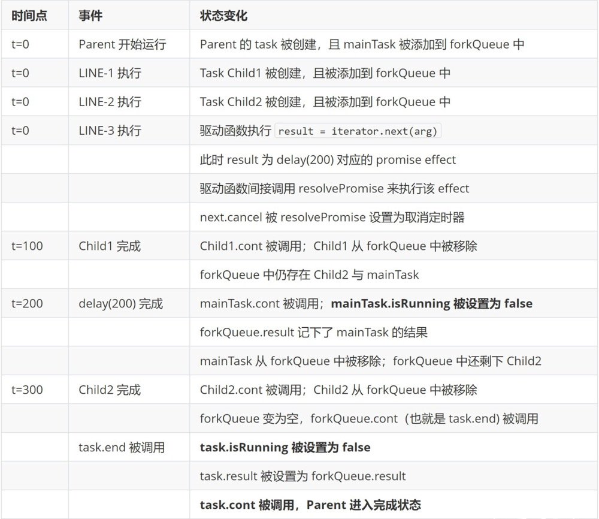

# Redux-saga 原理

## 从指令入手

```javascript
call(fetchUserApi)
// {type: 'CALL', payload: {fn: fetchUserApi}}

put({type: "USER_FETCH_SUCCEEDED", user: 'zzy'})
// {type: 'PUT', payload: {action: {type: "USER_FETCH_SUCCEEDED", user: "zzy"}}}

takeEvery("FETCH_USER", fetchUser);
// {type: 'FORK', payload: {args: ["FETCH_USER, f* fetchUser"]}}

```

effects中返回的各种方法类似于actionCreator，类比到saga这里的作用是生成各种effect指令，接下来会根据各种指令做不同的操作。

## 核心流程

上面的generaor函数定义了各种指令，有的是发出有的是接受。定义好saga后就交给sagaMiddle来run

### 1. 创建middleware

```javascript
function sagaMiddleware({ getState, dispatch }) {
    boundRunSaga = runSaga.bind(null, {
      ...options,
      context,
      channel,
      dispatch,
      getState,
      sagaMonitor,
    })

    return next => action => {
      if (sagaMonitor && sagaMonitor.actionDispatched) {
        sagaMonitor.actionDispatched(action)
      }
      const result = next(action) // hit reducers
      channel.put(action)
      return result
    }
  }

  sagaMiddleware.run = (...args) => {
    if (process.env.NODE_ENV !== 'production' && !boundRunSaga) {
      throw new Error('Before running a Saga, you must mount the Saga middleware on the Store using applyMiddleware')
    }
    return boundRunSaga(...args)
  }
```

这里通过

```javascript
boundRunSaga = runSaga.bind(null, {
  ...options,
  context,
  channel,
  dispatch,
  getState,
  sagaMonitor,
})
```

 预设了一些参数，dispatch, getState就是redux store原封不动提供的函数, channel函数稍后讲解,其他参数默认为空,在createSagaMiddle中传入。

### 2. runSaga

首先调用const iterator = saga(...args)

这里的saga就是我们传入的rootSaga，执行rootSaga返回迭代器iterator

接下来runSaga对入参做了包装

```javascript
  const env = {
    channel,
    dispatch: wrapSagaDispatch(dispatch),
    getState,
    sagaMonitor,
    onError,
    finalizeRunEffect,
  }
```

```javascript
  if (effectMiddlewares) {
    const middleware = compose(...effectMiddlewares)
    finalizeRunEffect = runEffect => {
      return (effect, effectId, currCb) => {
        const plainRunEffect = eff => runEffect(eff, effectId, currCb)
        return middleware(plainRunEffect)(effect)
      }
    }
  } else {
    finalizeRunEffect = runEffect => runEffect
  }
```

  finalizeRunEffect是对runEffect的包装，如果createMiddleware时传入了effectMiddlewares参数，这个参数就是普通的redux中间件，如果你想某些中间件只增强saga不对普通的reducer做增强，可以用这个参数。如果不传入该参数，就原封不动的返回runEffect。
  前面都是预设包装变量，接下来调用proc(env, iterator, context, effectId, getMetaInfo(saga), /*isRoot*/ true, undefined)

### 3. proc

proc.js是saga运行的核心流程

在上一步我们执行了saga得到了iterator,这个时候代码停留在了

```javascript
function* mySaga() {
  yield takeEvery("FETCH_USER", fetchUser);
  yield take("ADD_ONE_SAGA", addOne);
}
```

第一个yield这里。接下里我们要take多个指令，所以我们希望我们的generator函数能自动执行。

类似co函数，saga里根据自身的业务做了一些变体

```javascript
  // 简化版
  function next(arg, isErr) {
    let result
    if (shouldTerminate(arg)) {
      // We get TERMINATE flag, i.e. by taking from a channel that ended using `take` (and not `takem` used to trap End of channels)
      result = is.func(iterator.return) ? iterator.return() : { done: true }
    } else {
      result = iterator.next(arg)
    }

    if (!result.done) {
      digestEffect(result.value, parentEffectId, next)
    } else {
      /**
        This Generator has ended, terminate the main task and notify the fork queue
      **/
      if (mainTask.status !== CANCELLED) {
        mainTask.status = DONE
      }
      mainTask.cont(result.value)
    }
  }
  next();
```

这里的next是saga自己定义的next，不是redux中间件的next。

next函数首先判断是否要终止,如果是直接iterator.return掉。如果还不需要中止，调用iterator.next()

如果iterator还没有done调用digestEffect(result.value, parentEffectId, next) 并把result.value和next函数自身传进去

在digestEffect里面定义了currCb并对next增加了cancel功能， 最后调用finalRunEffect，这里的finalRunEffect在createSagaMiddle没有传入middleares的情况下就是runEffect函数

我们来看下runEffect函数

```javascript
function runEffect(effect, effectId, currCb) {
    /**
      each effect runner must attach its own logic of cancellation to the provided callback
      it allows this generator to propagate cancellation downward.

      ATTENTION! effect runners must setup the cancel logic by setting cb.cancel = [cancelMethod]
      And the setup must occur before calling the callback

      This is a sort of inversion of control: called async functions are responsible
      of completing the flow by calling the provided continuation; while caller functions
      are responsible for aborting the current flow by calling the attached cancel function

      Library users can attach their own cancellation logic to promises by defining a
      promise[CANCEL] method in their returned promises
      ATTENTION! calling cancel must have no effect on an already completed or cancelled effect
    **/
    if (is.promise(effect)) {
      resolvePromise(effect, currCb)
    } else if (is.iterator(effect)) {
      // resolve iterator
      proc(env, effect, task.context, effectId, meta, /* isRoot */ false, currCb)
    } else if (effect && effect[IO]) {
      const effectRunner = effectRunnerMap[effect.type]
      effectRunner(env, effect.payload, currCb, executingContext)
    } else {
      // anything else returned as is
      currCb(effect)
    }
  }
```

可以看到我们yield的东西可以是Promise，iterator，effect指令或者是其他东西。

我们这里先只考虑通过call take等函数生成的effect

接着我们会根据effect type来执行不同的effectRunner

```javascript
const effectRunnerMap = {
  [effectTypes.TAKE]: runTakeEffect,
  [effectTypes.PUT]: runPutEffect,
  [effectTypes.ALL]: runAllEffect,
  [effectTypes.RACE]: runRaceEffect,
  [effectTypes.CALL]: runCallEffect,
  [effectTypes.CPS]: runCPSEffect,
  [effectTypes.FORK]: runForkEffect,
  [effectTypes.JOIN]: runJoinEffect,
  [effectTypes.CANCEL]: runCancelEffect,
  [effectTypes.SELECT]: runSelectEffect,
  [effectTypes.ACTION_CHANNEL]: runChannelEffect,
  [effectTypes.CANCELLED]: runCancelledEffect,
  [effectTypes.FLUSH]: runFlushEffect,
  [effectTypes.GET_CONTEXT]: runGetContextEffect,
  [effectTypes.SET_CONTEXT]: runSetContextEffect,
}
```

我们先看一下最常用的take put

```javascript

function runTakeEffect(env, { channel = env.channel, pattern, maybe }, cb) {
  const takeCb = input => {
    if (input instanceof Error) {
      cb(input, true)
      return
    }
    if (isEnd(input) && !maybe) {
      cb(TERMINATE)
      return
    }
    cb(input)
  }
  try {
    channel.take(takeCb, is.notUndef(pattern) ? matcher(pattern) : null)
  } catch (err) {
    cb(err, true)
    return
  }
  cb.cancel = takeCb.cancel
}
```

我们先忽略掉channel.take里面的细节,目前我们只需要知道channel.take里面最终会执行takeCb, takeCb里面执行传入的cb，也就是我们上面定义的next函数。

这样我们就实现了generator的自动执行，和co函数不同的是，我们这里的两次递归调用之间加了很多逻辑。

值得注意的是call effect

```javascript
function runCallEffect(env, { context, fn, args }, cb, { task }) {
  // catch synchronous failures; see #152
  try {
    const result = fn.apply(context, args)

    if (is.promise(result)) {
      resolvePromise(result, cb)
      return
    }

    if (is.iterator(result)) {
      // resolve iterator
      proc(env, result, task.context, currentEffectId, getMetaInfo(fn), /* isRoot */ false, cb)
      return
    }

    cb(result)
  } catch (error) {
    cb(error, true)
  }
}
```

yield call(fn)里的fn如果还是返回一个iterator,这里就会递归调用proc

在fork effect里也会递归调用proc，用于生成child_saga

```javascript
function runForkEffect(env, { context, fn, args, detached }, cb, { task: parent }) {
  const taskIterator = createTaskIterator({ context, fn, args })
  const meta = getIteratorMetaInfo(taskIterator, fn)

  immediately(() => {
    const child = proc(env, taskIterator, parent.context, currentEffectId, meta, detached, undefined)

    if (detached) {
      cb(child)
    } else {
      if (child.isRunning()) {
        parent.queue.addTask(child)
        cb(child)
      } else if (child.isAborted()) {
        parent.queue.abort(child.error())
      } else {
        cb(child)
      }
    }
  })
  // Fork effects are non cancellables
}
```

这样我们通过proc和next的双重递归，实现了iterator的自动执行和多个saga的执行

### 4. 监听和派发-通道(Channel)

解决了组合saga和自动执行iterator之后，我们还有个问题没有处理。那就是怎么把PUT出去的指令在TAKE那里接收到，以及接收到指令之后怎么dispatch到redux的reducer

Channel用到了ringBuffer(圆形缓冲区,也称作圆形队列（circular queue），循环缓冲区（cyclic buffer），环形缓冲区（ring buffer）)的数据结构，现在简单介绍一下

如下图所示，每一个格子都是一个缓存区，首位相连构成一个环形


```javascript

function ringBuffer(limit = 10) {
  console.log('init limit:', limit);
  let arr = new Array(limit)
  let length = 0
  let pushIndex = 0
  let popIndex = 0

  const push = it => {
    arr[pushIndex] = it
    pushIndex = (pushIndex + 1) % limit
    length++
  }

  const take = () => {
    if (length != 0) {
      let it = arr[popIndex]
      arr[popIndex] = null
      length--
      popIndex = (popIndex + 1) % limit
      return it
    }
  }

  const flush = () => {
    let items = []
    while (length) {
      items.push(take())
    }
    return items
  }

  return {
    isEmpty: () => length == 0,
    put: it => {
      if (length < limit) {
        push(it)
      } else {
        let doubledLimit
        doubledLimit = 2 * limit
        arr = flush()
        length = arr.length
        pushIndex = arr.length
        popIndex = 0
        arr.length = doubledLimit
        limit = doubledLimit
        push(it)
      }
    },
    take,
    flush,
    show: () => {
      console.log(arr);
    },
  }
}

const buffer = ringBuffer(5);
for (let i = 0; i < 10; i++ ) {
  buffer.put(i + 1);
}
console.log(buffer.take());
console.log(buffer.take());
buffer.show();
buffer.put('x');
buffer.show();

```

Channel

```javascript
export function channel(buffer = buffers.expanding()) {
  let closed = false
  let takers = []

  if (process.env.NODE_ENV !== 'production') {
    check(buffer, is.buffer, INVALID_BUFFER)
  }

  function checkForbiddenStates() {
    if (closed && takers.length) {
      throw internalErr(CLOSED_CHANNEL_WITH_TAKERS)
    }
    if (takers.length && !buffer.isEmpty()) {
      throw internalErr('Cannot have pending takers with non empty buffer')
    }
  }

  function put(input) {
    if (process.env.NODE_ENV !== 'production') {
      checkForbiddenStates()
      check(input, is.notUndef, UNDEFINED_INPUT_ERROR)
    }

    if (closed) {
      return
    }
    if (takers.length === 0) {
      return buffer.put(input)
    }
    const cb = takers.shift()
    cb(input)
  }

  function take(cb) {
    if (process.env.NODE_ENV !== 'production') {
      checkForbiddenStates()
      check(cb, is.func, "channel.take's callback must be a function")
    }

    if (closed && buffer.isEmpty()) {
      cb(END)
    } else if (!buffer.isEmpty()) {
      cb(buffer.take())
    } else {
      takers.push(cb)
      cb.cancel = () => {
        remove(takers, cb)
      }
    }
  }

  function flush(cb) {
    if (process.env.NODE_ENV !== 'production') {
      checkForbiddenStates()
      check(cb, is.func, "channel.flush' callback must be a function")
    }

    if (closed && buffer.isEmpty()) {
      cb(END)
      return
    }
    cb(buffer.flush())
  }

  function close() {
    if (process.env.NODE_ENV !== 'production') {
      checkForbiddenStates()
    }

    if (closed) {
      return
    }

    closed = true

    const arr = takers
    takers = []

    for (let i = 0, len = arr.length; i < len; i++) {
      const taker = arr[i]
      taker(END)
    }
  }

  return {
    take,
    put,
    flush,
    close,
  }
}
```

### 5. 任务管理-Task Queue

每次执行proc函数时总会调用

```javascript
/** 创建一个主任务用来追溯主流程 */
  const mainTask = { meta, cancel: cancelMain, status: RUNNING }
  /**
   * 为当前generator创建工作描述符
   * 这里的任务是主任务和fork任务的集合
   **/
  const task = newTask(env, mainTask, parentContext, parentEffectId, meta, isRoot, cont)
```

这时mainTask上有了cancelMain和cont两个方法，cont是continue的缩写，意味着当前iterator迭代完的后续动作

cancelMain调用next(Symbol('TASK_CANCEL')) 最终调用的是各个effectRunner自己的cancel方法。
cont方法如下所示，在迭代完iterator之后执行

```javascript
function cancelMain() {
  if (mainTask.status === RUNNING) {
    mainTask.status = CANCELLED
    next(TASK_CANCEL)
  }
}
function next() {
  // ...
    if (!result.done) {
        digestEffect(result.value, parentEffectId, next)
      } else {
        /**
          This Generator has ended, terminate the main task and notify the fork queue
        **/
      if (mainTask.status !== CANCELLED) {
        mainTask.status = DONE
      }
      mainTask.cont(result.value)
    }
  // ...
}
```

cont是在执行newTask时挂载在mainTask上的,我们来看下调用newTask时是如何创建任务队列的:

```javascript
 /**
  * 用来追溯父任务和它的forks
  * 在fork模式下，fork的任务被默认挂在在父任务下
  * 我们通过父任务和主任务来实现它
  * 主任务是当前generator的主要工作流，父任务是主任务和他所有fork任务的集合。
  * 因此，整个模式表示的是有多个分支的执行树
  * 
  * 一个父任务有以下特性:
  * - 它所有fork的任务都完成或者取消，它也会完成
  * - 如果父任务取消，所有fork任务也取消
  * - 如果fork任务抛出任何未捕捉的异常，父任务会中止
  * - 如果父任务完成，那返回值就是主任务的返回值?
  * 
  */
export default function forkQueue(mainTask, onAbort, cont) {
  let tasks = []
  let result
  let completed = false

  addTask(mainTask)
  const getTasks = () => tasks

  function abort(err) {
    onAbort()
    cancelAll()
    cont(err, true)
  }

  function addTask(task) {
    tasks.push(task)
    task.cont = (res, isErr) => {
      if (completed) {
        return
      }

      remove(tasks, task)
      task.cont = noop
      if (isErr) {
        abort(res)
      } else {
        if (task === mainTask) {
          result = res
        }
        if (!tasks.length) {
          completed = true
          cont(result)
        }
      }
    }
  }

  function cancelAll() {
    if (completed) {
      return
    }
    completed = true
    tasks.forEach(t => {
      t.cont = noop
      t.cancel()
    })
    tasks = []
  }

  return {
    addTask,
    cancelAll,
    abort,
    getTasks,
  }
}
```

每次调用forkQueue都会往tasks里push一个新的task，并挂载上cont方法，并判断当前task队列是否完成，如果没有完成就把当前task移除队列，如果队列为空就标记完成

任务队列和父子saga之间的关系如图


一个例子看下task的运行

```javascript
function* Parent() {
  const Child1 = yield fork(api.xxxx) // LINE-1 需要 100ms 才能完成
  const Child2 = yield fork(api.yyyy) // LINE-2 需要 300ms 才能完成
  yield delay(200) // LINE-3 需要 200 ms 才能完成
}
```



### 6.总结
